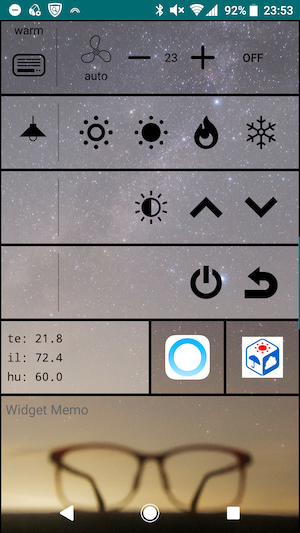
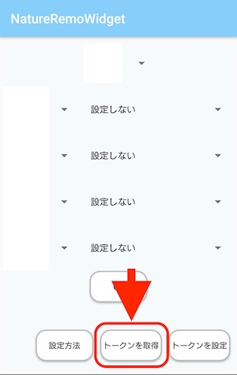
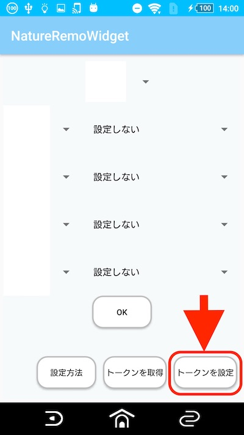

NatureRemoWidget
====

NatureRemoのAndroidウィジェット。
ホーム画面からNatureRemoを操作できます。



## Usage

1. ウィジェット設定画面下部の「トークンを取得」ボタンを押す。  

    

1. ブラウザで開かれたページにログインし、
    ページ下部の「+Generate access token」ボタンを押しアクセストークンを発行。
    表示されたトークンは再度表示されないのでメモしておいてください。  
1. ウィジェット設定画面に戻り、「トークンを設定」ボタンを押す。

    

1. テキストボックスに先ほど取得したトークンを入力。

    

1. 「OK」ボタンを押してトークンを設定。

## Install

このプロジェクトをダウンロードまたは```git clone```し、
AndroidStudioで端末にインストールする。


## Licence

[MIT](./LICENSE)
